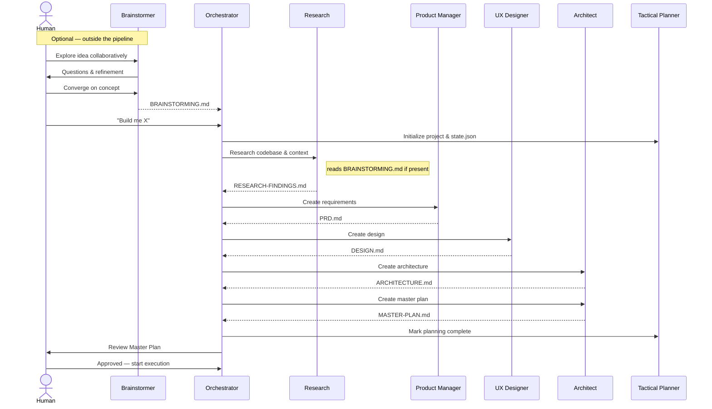
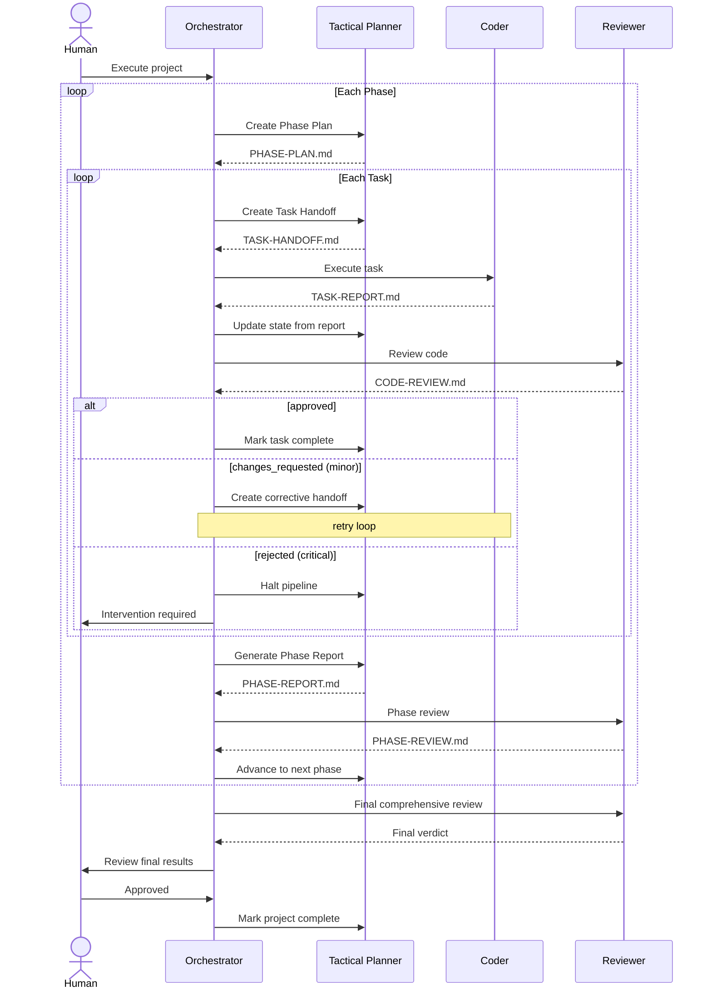

# Pipeline

The orchestration pipeline takes a project from idea through planning, execution, and review. It enforces human gates at critical decision points and handles errors automatically based on severity.

## Pipeline Tiers

The pipeline progresses through four tiers:

```
planning → execution → review → complete
```

A project can also be `halted` from any tier when a critical error occurs or a human gate is not satisfied.

## Planning Pipeline

The planning phase produces all the documents needed before any code is written.



### Planning Steps

Each planning step runs sequentially in fixed order:

| Step | Agent | Output |
|------|-------|--------|
| 1. Research | Research | `RESEARCH-FINDINGS.md` |
| 2. Requirements | Product Manager | `PRD.md` |
| 3. Design | UX Designer | `DESIGN.md` |
| 4. Architecture | Architect | `ARCHITECTURE.md` |
| 5. Master Plan | Architect | `MASTER-PLAN.md` |

After all steps complete, the system transitions to a **human gate** — the Master Plan must be reviewed and approved before execution begins.

## Execution Pipeline

Execution is organized into **phases**, each containing multiple **tasks**. Phases execute sequentially; tasks within a phase execute sequentially.



### Task Lifecycle

Each task progresses through a deterministic lifecycle:

1. **Handoff** — Tactical Planner creates a self-contained Task Handoff document
2. **Execution** — Coder implements the task and produces a Task Report
3. **State update** — Tactical Planner reads the report and updates `state.json`
4. **Review** — Reviewer evaluates the code against PRD, architecture, and design
5. **Triage** — The [Triage Executor](scripts.md) evaluates the review verdict against the decision table to determine the next action: advance, retry, or halt

### Phase Lifecycle

After all tasks in a phase are complete:

1. **Phase Report** — Tactical Planner aggregates task results and assesses exit criteria
2. **Phase Review** — Reviewer performs cross-task integration review
3. **Phase Triage** — Triage Executor processes the phase review verdict
4. **Advance or Correct** — either advance to the next phase or issue corrective tasks

## Human Gates

Human gates are enforced checkpoints that require explicit approval before the pipeline proceeds.

| Gate | When | Configurable? |
|------|------|---------------|
| **After planning** | Master Plan is complete | No — always enforced |
| **During execution** | Varies by mode | Yes — see below |
| **After final review** | All phases complete, final review done | No — always enforced |

### Execution Gate Modes

Controlled by `human_gates.execution_mode` in `orchestration.yml`:

| Mode | Behavior |
|------|----------|
| `ask` | Prompt the human at the start of execution for their preferred level of oversight |
| `phase` | Gate before each phase begins |
| `task` | Gate before each task begins |
| `autonomous` | No gates during execution — run all phases and tasks automatically |

## Error Handling

Errors are classified by severity with deterministic responses:

| Severity | Examples | Pipeline Response |
|----------|----------|------------------|
| **Critical** | Build failure, security vulnerability, architectural violation, data loss risk | Pipeline halts immediately. Human intervention required. Recorded in `errors.active_blockers`. |
| **Minor** | Test failure, lint error, review suggestion, missing coverage, style violation | Auto-retry via corrective task. Retry count incremented and checked against `limits.max_retries_per_task`. |

### Retry Budget

Each task has a retry budget defined by `limits.max_retries_per_task` (default: 2). When a task receives a `changes_requested` review with minor severity:

- If retries remain, a corrective task is issued with the review feedback
- If retries are exhausted, the pipeline halts for human intervention

The [Triage Executor](scripts.md) encodes this logic in a deterministic decision table — the same review verdict with the same retry state always produces the same action.

### Triage Attempts

The Orchestrator tracks a runtime `triage_attempts` counter for each triage action. If a triage action is repeated without the pipeline advancing (suggesting a loop), the Orchestrator halts after the second attempt. This counter resets when the pipeline successfully advances to the next task or phase.

## Pipeline Routing

Pipeline routing — the decision of what to do next given the current state — is handled by the deterministic [Next-Action Resolver](scripts.md). The resolver is a pure function that takes `state.json` as input and returns one of ~30 possible next actions from a closed enum.

The Orchestrator calls the resolver, pattern-matches on the returned action, and spawns the appropriate agent. This replaces prose-based decision trees with testable, deterministic logic.

See [Deterministic Scripts](scripts.md) for the full action vocabulary and routing logic.

## State Management

Pipeline state is tracked in `state.json` — see [Project Structure](project-structure.md) for the full state schema and invariants.

Key rules:
- Only the Tactical Planner writes `state.json`
- Every write is validated against 15 invariants before being committed
- Tasks progress linearly: `not_started` → `in_progress` → `complete` | `failed`
- Only one task can be `in_progress` at a time across the entire project
- `STATUS.md` provides a human-readable summary updated after every significant event
